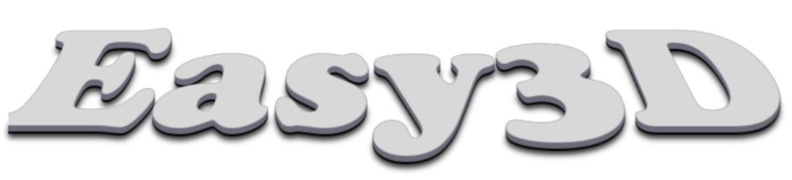
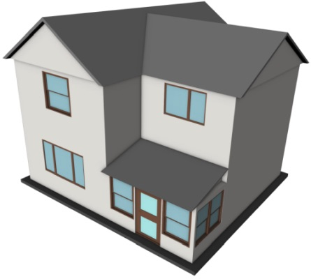
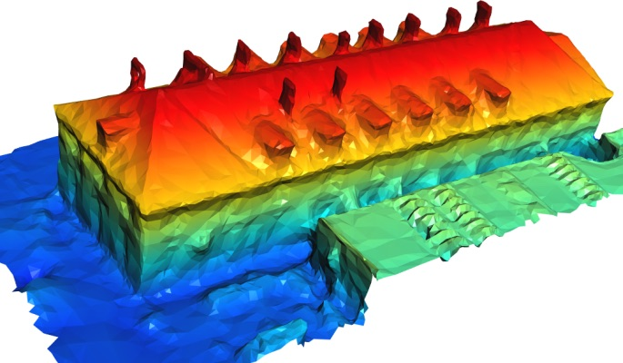
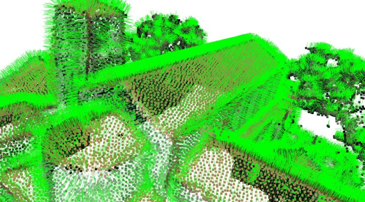
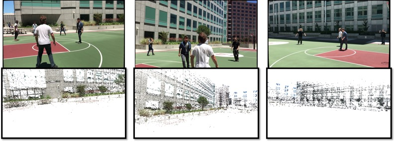
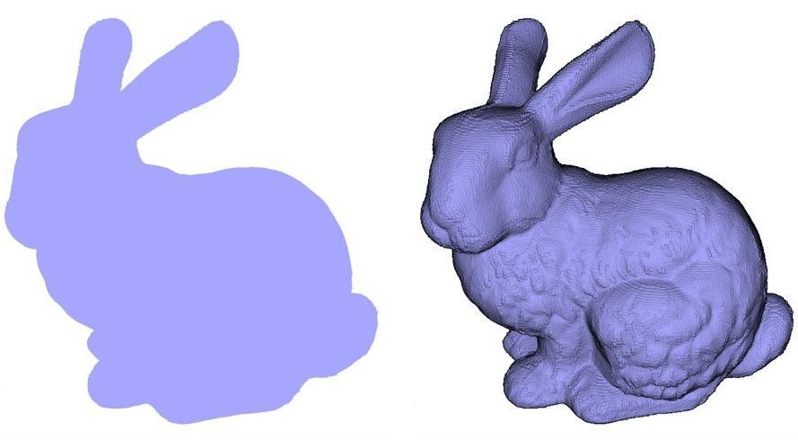
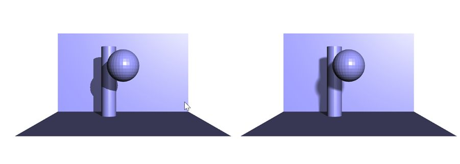
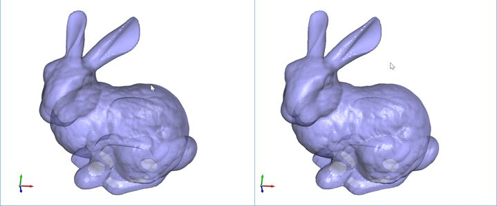

### Easy3D is an open source library for 3D modeling and geometry processing. It is implemented in C++ and designed with an emphasis on simplicity and efficiency. 
### Easy3D is intended for research and educational purposes, but it is also a good starting point for developing sophisticated 3D applications.


<center>
	
  |    |  
:-----------------------------------------:|:------------------------------------------:|:-------------------------------------------:
Fig.1 Point cloud                          |  Fig.2 Mesh                                |  Fig.3 Scalar field

 |   
:-----------------------------------------:|:------------------------------------------:
Vector field                               |   Rendering a model given camera intrinsic and extrinsic parameters


 |  |  
:--------------------------------------:|:------------------------------------------:|:------------------------------------------------:
Eye-dome lighting                       |  Shadow  				     |   Transparency	  

</center>

  
### Key features ###
* Efficient data structures for representing and managing 3D models (i.e., point clouds and meshes). Easy to add/access arbitrary types of per-element properties.
* High-level encapsulation of OpenGL and GLSL for convenient and efficient rendering (based on modern and faster programmable-shader-style rendering, i.e., no fixed function calls). Users do not need to touch the low-level APIs of OpenGL. 
* A bunch of rendering techniques, e.g., ambient occlusion (SSAO), hard shadow (shadow maps), soft shadow (PCSS), eye-dome lighting (for rendering point clouds without normal information), transparency (average color blending, dual depth peeling), and more ...
* A viewer that can be used directly to visualize 3D scenes in various formats, which can also be easily extended.
* Step-by-step tutorials to get acquainted with the data structures, rendering techniques, and processing algorithms for 3D modeling and geometry processing. 

** In progress and planed for the next release (~August 2019)**
 - KD-Tree
 - Point cloud normal estimation and re-orientation
 - Plane extraction from point clouds
 - Poisson surface reconstruction
 - [PolyFit: Polygonal surface reconstruction](https://github.com/LiangliangNan/PolyFit)
 - Textured rendering
 - Set line width for LinesDrawable
 - Line/point imposters
 - and more ...

 
### A quick glance ###

Any types of 3D drawables (e.g., points, lines, triangles, and thus point clouds, mesh surfaces, scalar fields, vector fields) can be rendered by writing a few lines of code. The following example loads a point cloud from a file, creates a drawable of the points, and then uses the default viewer to visualize the point cloud. The rendering result is shown in Figure 1.
```c++
	Viewer viewer;	// create the default Easy3D viewer

	// load a point cloud from a file
	PointCloud* cloud = PointCloudIO::load("../../../data/bunny.ply");
	
	// create a drawable (a set of points)
	PointsDrawable* drawable = cloud->add_points_drawable("points");

	// collect points, colors, and normals (if exist) and transfer them to GPU
	auto points = cloud->get_vertex_property<vec3>("v:point");
	drawable->update_vertex_buffer(points.vector());
	auto normals = cloud->get_vertex_property<vec3>("v:normal");
	if (normals)	// if normals exist
		drawable->update_normal_buffer(normals.vector());
	auto colors = cloud->get_vertex_property<vec3>("v:color");
	if (colors)	// if colors exist
		drawable->update_color_buffer(colors.vector());

	// add the model to the viewer
	viewer.add_model(cloud);

	// run the viewer
	viewer.run();
```

Bellow is another example showing how to render a surface model (the result is in Figure 2).
```c++
	SurfaceMesh* mesh = new SurfaceMesh;	// create a surface mesh
	
	// create a drawable for rendering the surface of this model
	TrianglesDrawable* drawable = mesh->add_triangles_drawable("surface");

	// transfer vertex coordinates and colors to the GPU. 
	drawable->update_vertex_buffer(demodata::vertices);	// an array of 3D points
	drawable->update_color_buffer(demodata::colors); 	// an array of colors
	
	drawable->set_per_vertex_color(true);	// vertices have different colors

	// add the model to the viewer
	viewer.add_model(mesh);
```

By abstracting geometric elements as one of the above drawables, more general visualization can be done very conveniently. Figure 3 shows the visualization of a scalar field (i.e., height) defined on the mesh vertices.

### Build

Easy3D has been tested on macOS, Linux, and Windows. You should also be able to build it on other platforms.

Clone or download the repository, run CMake to generate Makefiles or CMake/Visual Studio project files, 
and then use your favorite IDE to work with Easy3D.

In case you use *Qt Creator* or other IDEs that can handle the CMakeLists.txt file, simply open that file and then all files 
will be well organized as projects.

### License
Easy3D is free software; you can redistribute it and/or modify it under the terms of the 
GNU General Public License as published by the Free Software Foundation; either version 3
of the License or (at your option) any later version. The full text of the license can be
found in the accompanying 'License' file.

### Citation
If Easy3D is useful in your research/work, I would be grateful if you show your appreciation by citing it:
```
Liangliang Nan. 
Easy3D: a lightweight, easy-to-use, and efficient C++ library for processing and rendering 3D data. 
2018.
```

---

Should you have any questions, comments, or suggestions, please contact me at liangliang.nan@gmail.com

**_Liangliang Nan_**

https://3d.bk.tudelft.nl/liangliang/

Dec. 8, 2018

Copyright (C) 2018
