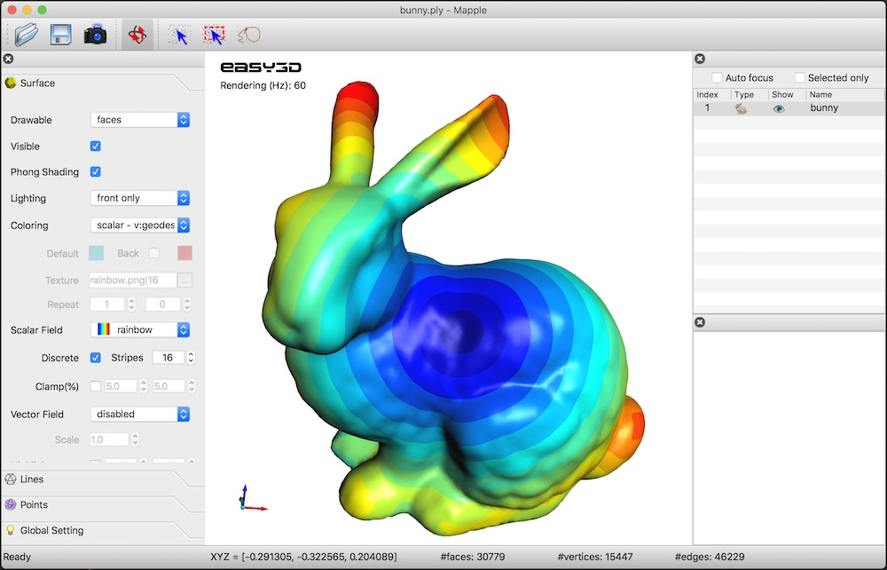
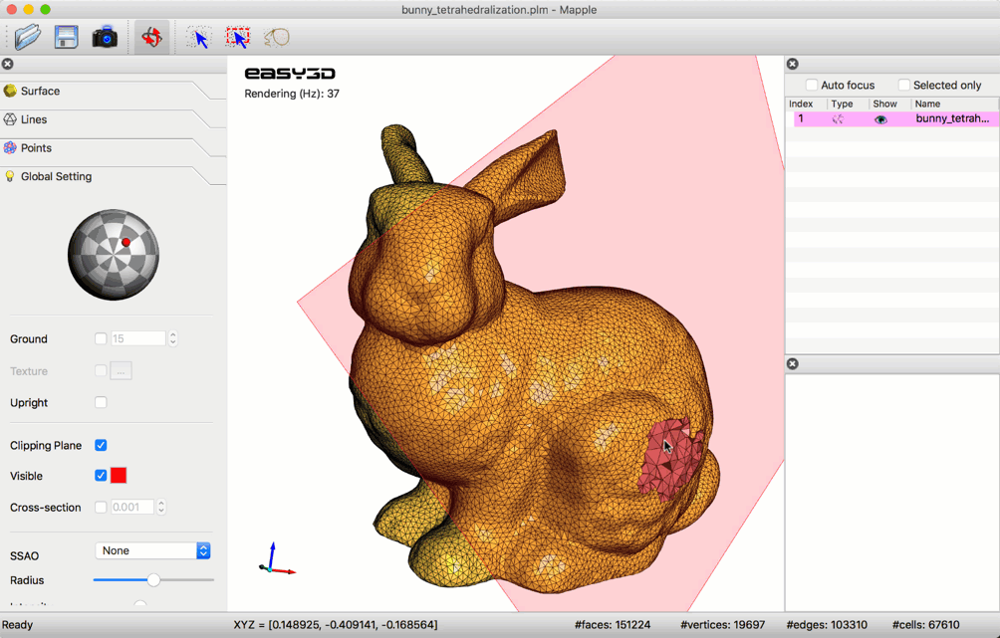

<p align="right">
    <b>  </b> <br>
    <b>  </b> <br>
</p>


(This 3D model of the Easy3D logo was generated and rendered by Easy3D).

#### Easy3D is an open-source library for 3D modeling, geometry processing, and rendering. It is implemented in C++ and designed with an emphasis on simplicity and efficiency. 
#### Easy3D is intended for research and educational purposes, but it is also a good starting point for developing sophisticated 3D applications.


### Key features ###
* Efficient data structures for representing and managing 3D models such as point clouds, polygonal surfaces 
  (e.g., triangle meshes), polyhedral volumes (e.g., tetrahedral meshes), and graphs. 
  Easy to add/access arbitrary types of per-element properties. Non-manifoldness is automatically resolved when 
  loading models from files ...
  
* A set of widely used algorithms, e.g., point cloud normal estimation/re-orientation, Poisson surface reconstruction, 
  RANSAC, mesh simplification, subdivision, smoothing, parameterization, remeshing, and more.
   
* A bunch of rendering techniques, e.g., point/line imposters, ambient occlusion (SSAO), hard shadow (shadow maps), 
  soft shadow (PCSS), eye-dome lighting (for rendering point clouds without normal information), transparency (average 
  color blending, dual depth peeling), and more.
   
* High-level encapsulation of OpenGL and GLSL for convenient and efficient rendering (based on modern and faster
  programmable-shader-style rendering, i.e., no fixed function calls). Client code does not need to touch the low-level 
  APIs of OpenGL. 
  
* Step-by-step tutorials demonstrating various uses of the API, to get acquainted with the data structures, rendering techniques, and algorithms 
  for 3D modeling and geometry processing. 
    
* A viewer that can be used directly to visualize 3D scenes in various formats, which can also be easily extended.

* A handy tool <b>Mapple</b> created out of the Easy3D library for rendering and processing 3D data.

|                 Scalar field                  |                   Polyhedral mesh                |
|-----------------------------------------------|--------------------------------------------------|
|   |  |

### A quick glance ###

Any types of 3D drawables (e.g., points, lines, triangles, and thus point clouds, mesh surfaces, scalar fields, 
vector fields) can be rendered by writing a few lines of code with Easy3D. For example, the following code renders a 
point cloud as a set of spheres

```c++
    // assume your point cloud has been loaded to the viewer
    PointsDrawable* drawable = cloud->renderer()->get_points_drawable("vertices");
    drawable->set_impostor_type(PointsDrawable::SPHERE); // draw points as spheres.
    drawable->set_point_size(3.0f);    // set point size
```
or as a set of surfels (i.e., 3D discs)

```c++ 
    drawable->set_impostor_type(PointsDrawable::SURFEL);
``` 

By abstracting geometric elements as one of the above drawables, more general visualization (e.g., vector fields, 
scalar fields) can be done very conveniently.

### Build
Easy3D depends on some third-party libraries. All dependencies necessary for the core functionality and the basic
viewer are included in the distribution. So you don't need to do anything about third-party libraries. Easy3D 
also supports the use of Qt. You can switch on the following CMake option to include the related examples and 
applications (e.g., 
            [`Tutorial_202_Viewer_Qt`](https://github.com/LiangliangNan/Easy3D/tree/master/tutorials/Tutorial_202_Viewer_Qt) 
            and [`Mapple`](https://github.com/LiangliangNan/Easy3D/tree/master/applications/Mapple)) 
in your build:

- `EASY3D_ENABLE_QT`

To build Easy3D, you need [CMake](https://cmake.org/download/) and, of course, a compiler:

- CMake `>= 3.1`
- a compiler that supports `>= C++11`

Easy3D has been tested on macOS (Xcode >= 8), Windows (MSVC >=2015), and Linux (GCC >= 4.8, Clang >= 3.3). Machines 
nowadays typically provide higher [supports](https://en.cppreference.com/w/cpp/compiler_support), so you should be able 
to build Easy3D on almost all platforms.

There are many options to build Easy3D. Choose one of the following (or whatever you are familiar with):

- Option 1: Use any IDE that can directly handle CMakeLists files to open the `CMakeLists.txt` in the root directory of 
  Easy3D. Then you should have obtained a usable project and just build it. I recommend using 
[CLion](https://www.jetbrains.com/clion/) or [QtCreator](https://www.qt.io/product).
- Option 2: Use CMake to generate project files for your IDE. Then load the project to your IDE and build.
- Option 3: Use CMake to generate Makefiles and then `make` (on Linux/macOS) or `nmake`(on Windows with Microsoft 
  Visual Studio).

Don't have any experience with C/C++ programming? 
Have a look at <a href="https://github.com/LiangliangNan/Easy3D/blob/master/HowToBuild.md">How to build Easy3D step by 
step</a>.


### Documentation
The documentation for Easy3D-v2.4.1 is available [here](https://3d.bk.tudelft.nl/liangliang/software/easy3d_doc/html/index.html).

The Easy3D Documentation is an on-going effort with more and more details being added. You can build the latest Easy3D 
documentation from the source code.
Easy3D uses [Doxygen](https://www.doxygen.nl/index.html) (`>= 1.8.3`) to generate documentation from source code. 
To build it from the source code, [install Doxygen](https://www.doxygen.nl/manual/install.html) first. 
Then, switch on the CMake option `EASY3D_BUILD_DOCUMENTATION` in the main `CMakeList.txt`. Finally, build the `doc` 
target to generate the documentation. 


### License
Easy3D is free software; you can redistribute it and/or modify it under the terms of the 
GNU General Public License as published by the Free Software Foundation; either version 3
of the License or (at your option) any later version. The full text of the license can be
found in the accompanying 'License' file.

### Citation
If Easy3D is useful in your research/work, I would be grateful if you show your appreciation by citing it:

```bibtex
@misc{easy3d2018nan,
  title = {Easy3D: a lightweight, easy-to-use, and efficient C++ library for processing and rendering 3D data},
  author = {Liangliang, Nan},
  note = {\url{https://github.com/LiangliangNan/Easy3D}},
  year = {2018},
}
```
---------

Should you have any questions, comments, or suggestions, please contact me at liangliang.nan@gmail.com

<b><i>Liangliang Nan</i></b>

https://3d.bk.tudelft.nl/liangliang/

Dec. 8, 2018

Copyright (C) 2018
