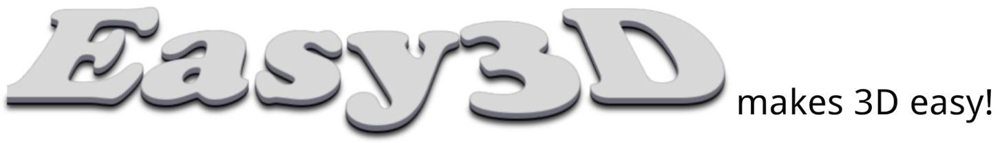
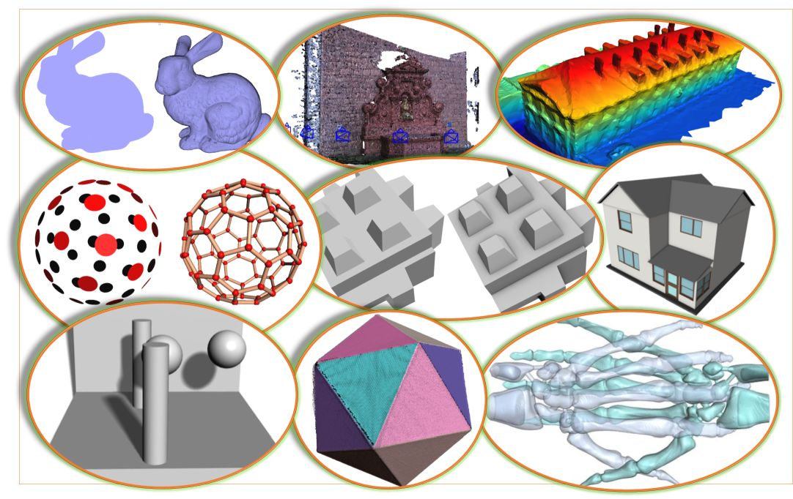
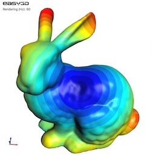
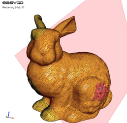
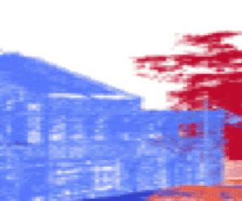

<p align="right">
    <b>  </b> <br>
    <b>  </b> <br>
</p>



#### Easy3D is an open-source library for 3D modeling, geometry processing, and rendering. It is implemented in C++ and designed with an emphasis on simplicity and efficiency. Easy3D is intended for research and educational purposes, but it is also a good starting point for developing sophisticated 3D applications. 
Compared to existing geometry processing libraries (such as [PMP](http://www.pmp-library.org/) and [libigl](https://github.com/libigl/libigl/)) that focus on the algorithm aspect, Easy3D also provides a wider range of functionalities for user interactions and rendering.

<p align="center"> 
      
</p>

### Key features ###
* Efficient data structures for representing and managing 3D models such as point clouds, polygonal surfaces 
  (e.g., triangle meshes), polyhedral volumes (e.g., tetrahedral meshes), and graphs. 
  Easy to add/access arbitrary types of per-element properties. Non-manifoldness is automatically resolved when 
  loading models from files ...
  
* A set of widely used algorithms, e.g., point cloud normal estimation/re-orientation, Poisson surface reconstruction, 
  RANSAC, mesh simplification, subdivision, smoothing, parameterization, remeshing, and more (the implementation of
  several surface mesh processing algorithms were taken from [PMP](http://www.pmp-library.org/)).
   
* A bunch of rendering techniques, e.g., point/line imposters, ambient occlusion (SSAO), hard shadow (shadow maps), 
  soft shadow (PCSS), eye-dome lighting (for rendering point clouds without normal information), transparency (average 
  color blending, dual depth peeling), and more.
   
* High-level encapsulation of OpenGL and GLSL for convenient and efficient rendering (based on modern and faster
  programmable-shader-style rendering, i.e., no fixed function calls). Client code does not need to touch the low-level 
  APIs of OpenGL. 
  
* Step-by-step tutorials demonstrating various uses of the API, to get acquainted with the data structures, rendering techniques, and algorithms 
  for 3D modeling and geometry processing. 
  
* Very easy to use as a callable library (usually only a few lines of code).
  
* A viewer that can be used directly to visualize 3D scenes in various formats, which can also be easily extended. 
  For window/GUI creation, Easy3D currently supports [GLFW](https://www.glfw.org/) (e.g., [the default viewer](https://github.com/LiangliangNan/Easy3D/blob/main/easy3d/viewer)), 
  [Qt](https://www.qt.io/) (see [the Qt viewer](https://github.com/LiangliangNan/Easy3D/tree/main/tutorials/Tutorial_204_Viewer_Qt)), 
  and [wxWidgets](https://www.wxwidgets.org/) (see [the wxWidgets viewer](https://github.com/LiangliangNan/Easy3D/tree/main/tutorials/Tutorial_203_Viewer_wxWidgets)).

* A handy tool <b>Mapple</b> created out of the Easy3D library for rendering and processing 3D data.

|              Scalar field                |              Polyhedral mesh              |              Keyframe animation            |
|------------------------------------------|-------------------------------------------|--------------------------------------------|
|   |  |  |

### A glance ###

Any type of 3D drawables (e.g., points, lines, triangles, and thus point clouds, mesh surfaces, scalar fields, 
and vector fields) can be rendered by writing a few lines of code with Easy3D. For example, the following code renders a 
point cloud as a set of spheres

```c++
// assume your point cloud has been loaded to the viewer
PointsDrawable* drawable = cloud->renderer()->get_points_drawable("vertices");
drawable->set_impostor_type(PointsDrawable::SPHERE); // draw points as spheres.
drawable->set_point_size(3.0f);    // set point size
```
or as a set of surfels (i.e., 3D discs)

```c++ 
drawable->set_impostor_type(PointsDrawable::SURFEL);
``` 

By abstracting geometric elements as one of the above drawables, more general visualization (e.g., vector fields, 
scalar fields) can be done very conveniently.

### Easy3D repository layout
The repository contains a `CMakeLists.txt` file (in the root directory of the repository) that serves as an anchor for 
configuring and building programs, as well as a set of subfolders:
* [`3rd_party`](https://github.com/LiangliangNan/Easy3D/tree/main/3rd_party) - source code of third-party libraries
* [`applications`](https://github.com/LiangliangNan/Easy3D/tree/main/applications) - applications built on top of Easy3D
* [`cmake`](https://github.com/LiangliangNan/Easy3D/tree/main/cmake) - CMake-related configuration files
* [`docs`](https://github.com/LiangliangNan/Easy3D/tree/main/docs) - documentation configuration file (Doxygen)
* [`easy3d`](https://github.com/LiangliangNan/Easy3D/tree/main/easy3d) - source code of Easy3D, implementing the Easy3D modules:
  * [`util`](https://github.com/LiangliangNan/Easy3D/tree/main/easy3d/util) - utilities, e.g., logging, file system, progress, timer.
  * [`core`](https://github.com/LiangliangNan/Easy3D/tree/main/easy3d/core) - basic types and data structures, e.g., point cloud, surface mesh, graph, and polyhedron mesh.
  * [`fileio`](https://github.com/LiangliangNan/Easy3D/tree/main/easy3d/fileio) - functionalities for reading/writing data from/into files.
  * [`kdtree`](https://github.com/LiangliangNan/Easy3D/tree/main/easy3d/kdtree) - a collection of kd-trees.
  * [`algo`](https://github.com/LiangliangNan/Easy3D/tree/main/easy3d/algo) - algorithms for geometry processing.
  * [`algo_ext`](https://github.com/LiangliangNan/Easy3D/tree/main/easy3d/algo_ext) - several extended surface mesh processing algorithms (based on CGAL).
  * [`video`](https://github.com/LiangliangNan/Easy3D/tree/main/easy3d/video) - a class that can encode an image sequence into a video.
  * [`renderer`](https://github.com/LiangliangNan/Easy3D/tree/main/easy3d/renderer) - functionalities and algorithms for rendering and visualization.
  * [`gui`](https://github.com/LiangliangNan/Easy3D/tree/main/easy3d/gui) - tools for user interactions, e.g., picking points, faces, or models.
  * [`viewer`](https://github.com/LiangliangNan/Easy3D/tree/main/easy3d/viewer) - a simple viewer and a composite viewer.
* [`resources`](https://github.com/LiangliangNan/Easy3D/tree/main/resources) - test data, images, shaders, textures, etc.
* [`tests`](https://github.com/LiangliangNan/Easy3D/tree/main/tests) - a collection of test cases
* [`tutorials`](https://github.com/LiangliangNan/Easy3D/tree/main/tutorials) - a collection of examples (with detailed explanations in code)

### Build Easy3D
Like most software, Easy3D depends on some third-party libraries. Easy3D has made this easier for users by including
the source code of most third-party libraries (for the core functionalities and the basic viewer), and it leaves very 
few optional (for a few additional features that are typically not needed by most users). 

The **optional** third-party libraries are:
- **[CGAL](https://www.cgal.org/) (optional)**: Easy3D has implemented a few algorithms for advanced surface mesh 
  processing, such as surface reorientation, detecting/resolving duplicate vertices/faces and self-intersection, 
  and clipping/splitting/slicing surface meshes. These features are disabled by default (because most users don't 
  need them). To enable these features, you can switch on the CMake option `Easy3D_ENABLE_CGAL` and make sure 
  CGAL ([v5.1 or later](https://github.com/CGAL/cgal/releases)) is installed and visible to CMake. In case you have
  multiple versions of CGAL on your platform, simply provide the path of a suitable one to the CMake variable `CGAL_DIR`.

- **[Qt5](https://www.qt.io/) (optional)**: Easy3D supports Qt ([v5.6 or later](https://download.qt.io/archive/qt/)) for 
  UI creation, which can help develop sophisticated applications for 3D data processing and visualization. The Qt 
  support is disabled by default (because most users don't need it). You can switch on the CMake option `Easy3D_ENABLE_QT` 
  to include the examples and applications that depend on Qt (e.g., 
  [`Tutorial_204_Viewer_Qt`](https://github.com/LiangliangNan/Easy3D/tree/main/tutorials/Tutorial_204_Viewer_Qt) and 
  [`Mapple`](https://github.com/LiangliangNan/Easy3D/tree/main/applications/Mapple)).
  
To build Easy3D, you need [CMake](https://cmake.org/download/) (`>= 3.12`) and, of course, a compiler that supports `>= C++11`.

Easy3D has been tested on macOS (Xcode >= 8), Windows (MSVC >=2015 `x64`), and Linux (GCC >= 4.8, Clang >= 3.3). Machines 
nowadays typically provide higher [support](https://en.cppreference.com/w/cpp/compiler_support), so you should be able 
to build Easy3D on almost all platforms.

There are many options to build Easy3D. Choose one of the following (not an exhaustive list):

- Option 1 (purely on the command line): Use CMake to generate Makefiles and then `make` (on Linux/macOS) or `nmake`(on Windows with Microsoft 
  Visual Studio). 
  - On Linux or macOS, you can simply
    ```
        $ cd path-to-root-dir-of-Easy3D
        $ mkdir Release
        $ cd Release
        $ cmake -DCMAKE_BUILD_TYPE=Release ..
        $ make
    ```
  - On Windows with Microsoft Visual Studio, use the `x64 Native Tools Command Prompt for VS XXXX` (**don't** use the x86 one), then
    ```
        $ cd path-to-root-dir-of-Easy3D
        $ mkdir Release
        $ cd Release
        $ cmake -G "NMake Makefiles" -DCMAKE_BUILD_TYPE=Release ..
        $ nmake
    ```
  
- Option 2: Use any IDE that can directly handle CMakeLists files to open the `CMakeLists.txt` in the **root** directory of 
  Easy3D. Then you should have obtained a usable project and just build it. I recommend using 
[CLion](https://www.jetbrains.com/clion/) or [QtCreator](https://www.qt.io/product). For Windows users: your IDE must be set for `x64`.
  
- Option 3: Use CMake-Gui to generate project files for your IDE. Then load the project to your IDE and build it. For Windows users: your IDE must be set for `x64`.

Don't have any experience with C/C++ programming? 
Have a look at <a href="https://github.com/LiangliangNan/Easy3D/blob/main/HowToBuild.md">How to build Easy3D step by 
step</a>.

### Test Easy3D
A test suite is provided in the `tests` subfolder, which contains a collection of automated test cases (for data 
structures, IO, algorithms, visualization, etc.) and some semi-automated test cases (for GUI-related functionalities 
that require interactive user input). All cases are integrated into the single target `tests`.

To build and run the test suite, download the entire source, use the `CMakeLists.txt` in the root directory of the 
repository, switch on the CMake option `Easy3D_BUILD_TESTS` (which is disabled by default), and run CMake. After CMake, 
you can build ALL or only the `tests` target. Finally, run the `tests` executable (i.e., `YOUR_BUILD_DIRECTORY/bin/tests`) for the test.

### Use Easy3D in your project
This is quite easy, like many other open-source libraries :-) 
After you have built Easy3D, you only need to point `Easy3D_DIR` to your `build` (or the installation) directory of Easy3D when doing cmake. Then the requested Easy3D libraries, including directories and relevant compile definitions of Easy3D, are visible and accessible to your project. Below is an example of using the default Easy3D viewer. 
The `CMakeLists.txt` looks like:
``` cmake
cmake_minimum_required(VERSION 3.12)
project(MyProject)
set(CMAKE_CXX_STANDARD 11)                       # specify C++ standard
find_package(Easy3D COMPONENTS viewer REQUIRED)  # request Easy3D (recommended to request only needed components)
add_executable(Test main.cpp)                    # create an executable target
target_link_libraries(Test easy3d::viewer)       # link to necessary Easy3D modules (add more if needed, e.g., algo)
```
and the `main.cpp` with minimum code:

``` c++
#include <easy3d/viewer/viewer.h>
#include <easy3d/util/initializer.h>

int main(int argc, char** argv) {
    easy3d::initialize();
    easy3d::Viewer viewer("Test");
    return viewer.run();
}
```

### Documentation
The documentation for Easy3D is available [here](https://3d.bk.tudelft.nl/liangliang/software/easy3d_doc/html/index.html).

The Easy3D Documentation is an ongoing effort with more and more details being added. You can build the latest Easy3D 
documentation from the source code.
Easy3D uses [Doxygen](https://www.doxygen.nl/index.html) (`>= 1.8.3`) to generate documentation from source code. 
To build it from the source code, [install Doxygen](https://www.doxygen.nl/manual/install.html) first. 
Then, switch on the CMake option `` in the main `CMakeList.txt`. Finally, build the `doc` 
target to generate the documentation. 

### Questions, new features, bugs, or contributing to Easy3D
See the [Contribution Guide](https://github.com/LiangliangNan/Easy3D/blob/main/CONTRIBUTING.md) for more information.

### License
Easy3D is free software; you can redistribute it and/or modify it under the terms of the 
GNU General Public License as published by the Free Software Foundation; either version 3
of the License or (at your option) any later version. The full text of the license can be
found in the accompanying 'License' file.

### Acknowledgments
The implementation of Easy3D greatly benefited from and was inspired by existing great open-source libraries, such as
[PMP](http://www.pmp-library.org/), [libQGLViewer](http://libqglviewer.com/), [Surface mesh](https://opensource.cit-ec.de/projects/surface_mesh),
and [Graphite](http://graphite.gforge.inria.fr/). In particular, the implementation of several surface mesh 
algorithms was taken (with modifications) from PMP, i.e., simplification, subdivision, smoothing, 
parameterization, remeshing, hole filling, geodesic distances, fairing, curvatures, and triangulation. 
We would like to thank the original authors of these projects for their permissive license terms. 
We also thank the users and contributors for reporting/fixing bugs, testing, and providing valuable feedback and suggestions.

### Citation
If you use Easy3D in scientific work, I kindly ask you to cite it:

```bibtex
@article{easy3d2021,
  title = {Easy3{D}: a lightweight, easy-to-use, and efficient {C}++ library for processing and rendering 3{D} data},
  author = {Liangliang Nan},
  journal = {Journal of Open Source Software}，
  year = {2021},
  volume = {6},
  number = {64},
  pages = {3255},
  doi = {10.21105/joss.03255},
  url = {https://doi.org/10.21105/joss.03255}
}
```
---------

Should you have any questions, comments, or suggestions, please contact me at <i>liangliang.nan@gmail.com</i>

[<b><i>Liangliang Nan</i></b>](https://3d.bk.tudelft.nl/liangliang/)

Dec. 8, 2018
