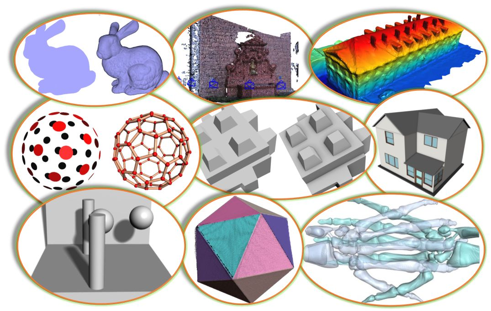

<p align="right">
    <b>  </b> <br>
    <b>  </b> <br>
</p>


#### Easy3D is an open-source library for 3D modeling, geometry processing, and rendering. It is implemented in C++ and designed with an emphasis on simplicity and efficiency. 
#### Easy3D is intended for research and educational purposes, but it is also a good starting point for developing sophisticated 3D applications.



### Key features ###
* Efficient data structures for representing and managing 3D models such as point clouds, polygonal surfaces 
  (e.g., triangle meshes), polyhedral volumes (e.g., tetrahedral meshes), and graphs. 
  Easy to add/access arbitrary types of per-element properties. Non-manifoldness is automatically resolved when 
  loading models from files ...
  
* A set of widely used algorithms, e.g., point cloud normal estimation/re-orientation, Poisson surface reconstruction, 
  RANSAC, mesh simplification, subdivision, smoothing, parameterization, remeshing, and more.
   
* A bunch of rendering techniques, e.g., point/line imposters, ambient occlusion (SSAO), hard shadow (shadow maps), 
  soft shadow (PCSS), eye-dome lighting (for rendering point clouds without normal information), transparency (average 
  color blending, dual depth peeling), and more.
   
* High-level encapsulation of OpenGL and GLSL for convenient and efficient rendering (based on modern and faster
  programmable-shader-style rendering, i.e., no fixed function calls). Client code does not need to touch the low-level 
  APIs of OpenGL. 
  
* Step-by-step tutorials demonstrating various uses of the API, to get acquainted with the data structures, rendering techniques, and algorithms 
  for 3D modeling and geometry processing. 
  
* Very easy to use as a callable library (usually only a few lines of code).
  
* A viewer that can be used directly to visualize 3D scenes in various formats, which can also be easily extended.

* A handy tool <b>Mapple</b> created out of the Easy3D library for rendering and processing 3D data.

|              Scalar field                |              Polyhedral mesh              |              Keyframe animation            |
|------------------------------------------|-------------------------------------------|--------------------------------------------|
|   |  |  |

### A quick glance ###

Any types of 3D drawables (e.g., points, lines, triangles, and thus point clouds, mesh surfaces, scalar fields, 
vector fields) can be rendered by writing a few lines of code with Easy3D. For example, the following code renders a 
point cloud as a set of spheres

```c++
// assume your point cloud has been loaded to the viewer
PointsDrawable* drawable = cloud->renderer()->get_points_drawable("vertices");
drawable->set_impostor_type(PointsDrawable::SPHERE); // draw points as spheres.
drawable->set_point_size(3.0f);    // set point size
```
or as a set of surfels (i.e., 3D discs)

```c++ 
drawable->set_impostor_type(PointsDrawable::SURFEL);
``` 

By abstracting geometric elements as one of the above drawables, more general visualization (e.g., vector fields, 
scalar fields) can be done very conveniently.

### Build
Like most software, Easy3D depends on some third-party libraries. Easy3D has made this easier for the users by including
the source code of most third-party libraries (for the core functionalities and the basic viewer), and it leaves very 
few optional (for a few additional features that are typically not needed by most users). 

The optional third-party libraries are:
- **[CGAL](https://www.cgal.org/)** (optional): Easy3D has implemented a few algorithms for advanced surface mesh 
  processing, such as surface reorientation, detecting/resolving duplicate vertices/faces and self-intersection, 
  and clipping/splitting/slicing surface meshes. These features are disabled by default (because most users don't 
  need them). To enable these features, you can switch on the CMake option `EASY3D_ENABLE_CGAL` and make sure 
  CGAL ([v5.1 or later](https://github.com/CGAL/cgal/releases)) is installed and visible to CMake. In case you have
  multiple versions of CGAL on your platform, simply provide the path of a suitable one to the CMake variable `CGAL_DIR`.

- **[Qt](https://www.qt.io/)** (optional): Easy3D supports Qt ([v5.6 or later](https://download.qt.io/archive/qt/)) for 
  UI creation, which can help develop sophisticated applications for 3D data processing and visualization. The Qt 
  support is disabled by default (because most users don't need it). You can switch on the CMake option `EASY3D_ENABLE_QT` 
  to include the examples and applications that depend on Qt (e.g., 
            [`Tutorial_202_Viewer_Qt`](https://github.com/LiangliangNan/Easy3D/tree/main/tutorials/Tutorial_202_Viewer_Qt) 
            and [`Mapple`](https://github.com/LiangliangNan/Easy3D/tree/main/applications/Mapple)).
  
To build Easy3D, you need [CMake](https://cmake.org/download/) (`>= 3.1`) and, of course, a compiler that supports `>= C++11`.

Easy3D has been tested on macOS (Xcode >= 8), Windows (MSVC >=2015), and Linux (GCC >= 4.8, Clang >= 3.3). Machines 
nowadays typically provide higher [supports](https://en.cppreference.com/w/cpp/compiler_support), so you should be able 
to build Easy3D on almost all platforms.

There are many options to build Easy3D. Choose one of the following (or whatever you are familiar with):

- Option 1: Use CMake to generate Makefiles and then `make` (on Linux/macOS) or `nmake`(on Windows with Microsoft 
  Visual Studio). For example, on Linux or macOS, you can simply
  ```
  $ cd Easy3D
  $ mkdir Release
  $ cd Release
  $ cmake -DCMAKE_BUILD_TYPE=Release ..
  $ make
  ```
  
- Option 2: Use any IDE that can directly handle CMakeLists files to open the `CMakeLists.txt` in the root directory of 
  Easy3D. Then you should have obtained a usable project and just build it. I recommend using 
[CLion](https://www.jetbrains.com/clion/) or [QtCreator](https://www.qt.io/product).
  
- Option 3: Use CMake to generate project files for your IDE. Then load the project to your IDE and build.

Don't have any experience with C/C++ programming? 
Have a look at <a href="https://github.com/LiangliangNan/Easy3D/blob/main/HowToBuild.md">How to build Easy3D step by 
step</a>.

### Use Easy3D in your project
This is quite easy, maybe easier than many other open-source libraries :-) You only need to add the following lines 
to your CMakeLists file (don't forget to replace `YOUR_APP_NAME` with the actual name of your application) and point 
`Easy3D_DIR` to your `build` directory of Easy3D when doing cmake. Then the requested Easy3D libraries, include 
directories, and relevant compile definitions of Easy3D are visible and accessible to your project.
```
set(CMAKE_CXX_STANDARD 11)                        # specify C++ standard
find_package(Easy3D REQUIRED)                     # request Easy3D 
target_link_libraries(YOUR_APP_NAME easy3d::core) # request necessary Easy3D modules (add more if needed, e.g., viewer, algo)
```
The minimum code to have a 3D viewer:

```c++
#include <easy3d/viewer/viewer.h>

int main(int argc, char** argv) {
    easy3d::Viewer viewer("Test");
    return viewer.run();
}
```

### Documentation
The documentation for Easy3D-v2.4.4 is available [here](https://3d.bk.tudelft.nl/liangliang/software/easy3d_doc/html/index.html).

The Easy3D Documentation is an on-going effort with more and more details being added. You can build the latest Easy3D 
documentation from the source code.
Easy3D uses [Doxygen](https://www.doxygen.nl/index.html) (`>= 1.8.3`) to generate documentation from source code. 
To build it from the source code, [install Doxygen](https://www.doxygen.nl/manual/install.html) first. 
Then, switch on the CMake option `EASY3D_BUILD_DOCUMENTATION` in the main `CMakeList.txt`. Finally, build the `doc` 
target to generate the documentation. 

### Questions, new features, bugs, or you want to contribute
Please click [here](https://github.com/LiangliangNan/Easy3D/blob/main/CONTRIBUTING.md).

### License
Easy3D is free software; you can redistribute it and/or modify it under the terms of the 
GNU General Public License as published by the Free Software Foundation; either version 3
of the License or (at your option) any later version. The full text of the license can be
found in the accompanying 'License' file.

### Citation
If you use Easy3D in a scientific work, I kindly ask you to cite it:

```bibtex
@misc{easy3d2018nan,
  title={Easy3D: a lightweight, easy-to-use, and efficient C++ library for processing and rendering 3D data},
  author={Nan, Liangliang},
  note={\url{https://github.com/LiangliangNan/Easy3D}},
  year={2018}
}
```

---------

Should you have any questions, comments, or suggestions, please contact me at <i>liangliang.nan@gmail.com</i>

[<b><i>Liangliang Nan</i></b>](https://3d.bk.tudelft.nl/liangliang/)

Dec. 8, 2018
