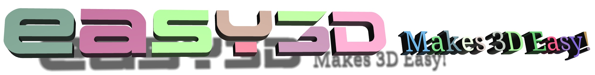

#### Easy3D is an open-source library for 3D modeling, geometry processing, and rendering. It is implemented in C++ and designed with an emphasis on simplicity and efficiency. 
#### Easy3D is intended for research and educational purposes, but it is also a good starting point for developing sophisticated 3D applications.


<center>
    
  |    |  
:-----------------------------------------:|:------------------------------------------:|:-------------------------------------------:
Fig.1 Point cloud                          |  Fig.2 Mesh                                |  Fig.3 Scalar field

 |   
:-----------------------------------------:|:------------------------------------------:
Vector field                               |   Rendering a model given camera intrinsic and extrinsic parameters


 |  |  
:--------------------------------------:|:------------------------------------------:|:------------------------------------------------:
Eye-dome lighting                       |  Shadow                                    |   Transparency    

|  |  
:-------------------------------------------:|:--------------------------------------------------:|:------------------------------------------------:
Point/Line imposters                         |  Surface reconstruction                            |   Plane extraction                                  

</center>

  
### Key features ###
* Efficient data structures for representing and managing 3D models (i.e., point clouds, meshes, and graphs). Easy to add/access arbitrary types of per-element properties.
* High-level encapsulation of OpenGL and GLSL for convenient and efficient rendering (based on modern and faster programmable-shader-style rendering, i.e., no fixed function calls). Users do not need to touch the low-level APIs of OpenGL. 
* A bunch of rendering techniques, e.g., point/line imposters, ambient occlusion (SSAO), hard shadow (shadow maps), soft shadow (PCSS), eye-dome lighting (for rendering point clouds without normal information), transparency (average color blending, dual depth peeling), and more ...
* A set of widely used algorithms, e.g., point cloud normal estimation/re-orientation, [Poisson Surface Reconstruction](http://www.cs.jhu.edu/~misha/MyPapers/ToG13.pdf), [RANSAC](http://citeseerx.ist.psu.edu/viewdoc/download?doi=10.1.1.481.1514&rep=rep1&type=pdf).
* A viewer that can be used directly to visualize 3D scenes in various formats, which can also be easily extended.
* Step-by-step tutorials to get acquainted with the data structures, rendering techniques, and processing algorithms for 3D modeling and geometry processing. 
 
 
### A quick glance ###

Any types of 3D drawables (e.g., points, lines, triangles, and thus point clouds, mesh surfaces, scalar fields, vector fields) can be rendered by writing a few lines of code. For example, only two lines of code to have a viewer to visualize you point clouds, meshes, or graphs

```c++
        Viewer viewer("MyViewer");
        viewer.run();
```

Of course, you can customize the drawables. For example, the following code renders a point cloud as a set of spheres

```c++
	// assume your point cloud has been loaded to the viewer
	PointsDrawable* drawable = cloud->points_drawable("vertices");
	drawable->set_impostor_type(PointsDrawable::SPHERE); // draw points as spheres.
	drawable->set_point_size(3.0f);    // set point size
```
or as a set of surfels (i.e., 3D discs)
```c++ 
    	drawable->set_impostor_type(PointsDrawable::SURFEL);
``` 

By abstracting geometric elements as one of the above drawables, more general visualization (e.g., vector fields, scalar fields) can be done very conveniently.

### Build
Easy3D depends on some third-party libraries and **all dependencies are included** in the distribution. 

To build Easy3D, you must have
- `CMake >= 3.1
- a compiler that supports `>= C++11`

Easy3D has been tested on macOS (Xcode >= 7), Windows (MSVC >=2015), and Linux (GCC >= 4.8, Clang >= 3.3). Machines nowadays typically provide higher supports, so you should be able to build Easy3D on almost all platforms.

There are many options to build Easy3D, e.g.,
- Using an IDE. I recommend using [CLion](https://www.jetbrains.com/clion/) or [QtCreator](https://www.qt.io/product). Simply open the `CMakeLists.txt` in the root directory to obtain a usable project.
- Run CMake to generate project file(s) or Makefile(s) for your build system.

**Optional dependencies**: Easy3D also supports the use of CGAL and Qt for advanced algorithms and UI, respectively. These optional features can be enabled by switching on the corresponding CMake boolean options:
- `EASY3D_ENABLE_CGAL`     Compile CGAL-based algorithms (see [`./easy3d/algo_ext`](https://github.com/LiangliangNan/Easy3D/tree/master/tutorials/Tutorial_303_Viewer_Qt))
- `EASY3D_ENABLE_QT`     Compile Qt-based examples and applications (e.g., [`Tutorial_303_Viewer_Qt`](https://github.com/LiangliangNan/Easy3D/tree/master/tutorials/Tutorial_303_Viewer_Qt))

### License
Easy3D is free software; you can redistribute it and/or modify it under the terms of the 
GNU General Public License as published by the Free Software Foundation; either version 3
of the License or (at your option) any later version. The full text of the license can be
found in the accompanying 'License' file.

### Citation
If Easy3D is useful in your research/work, I would be grateful if you show your appreciation by citing it:

```bibtex
@misc{easy3d2018nan,
  title = {Easy3D: a lightweight, easy-to-use, and efficient C++ library for processing and rendering 3D data},
  author = {Liangliang, Nan},
  note = {\url{https://github.com/LiangliangNan/Easy3D}},
  year = {2018},
}
```
---------

Should you have any questions, comments, or suggestions, please contact me at liangliang.nan@gmail.com

**_Liangliang Nan_**

https://3d.bk.tudelft.nl/liangliang/

Dec. 8, 2018

Copyright (C) 2018
